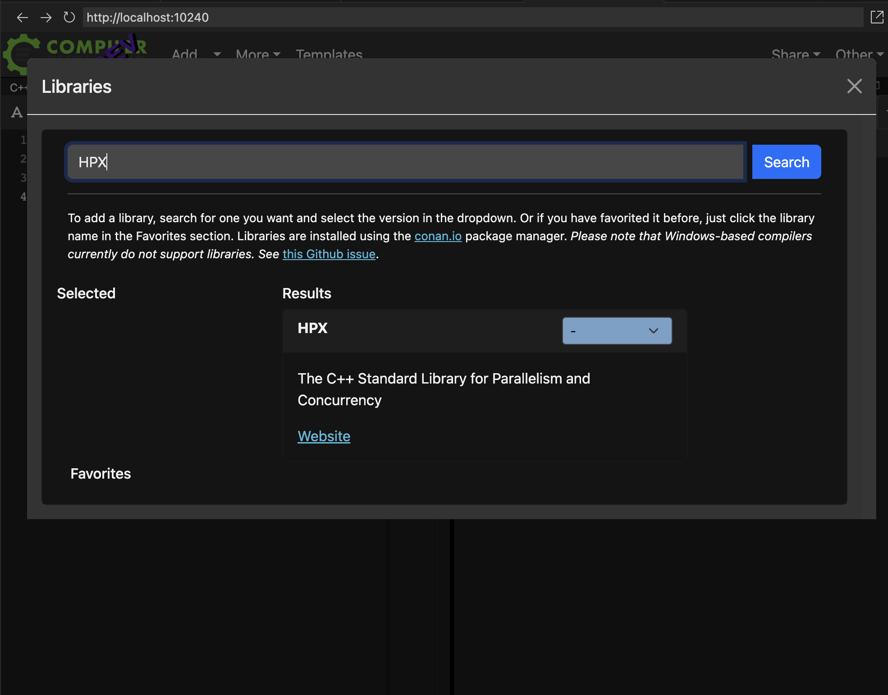
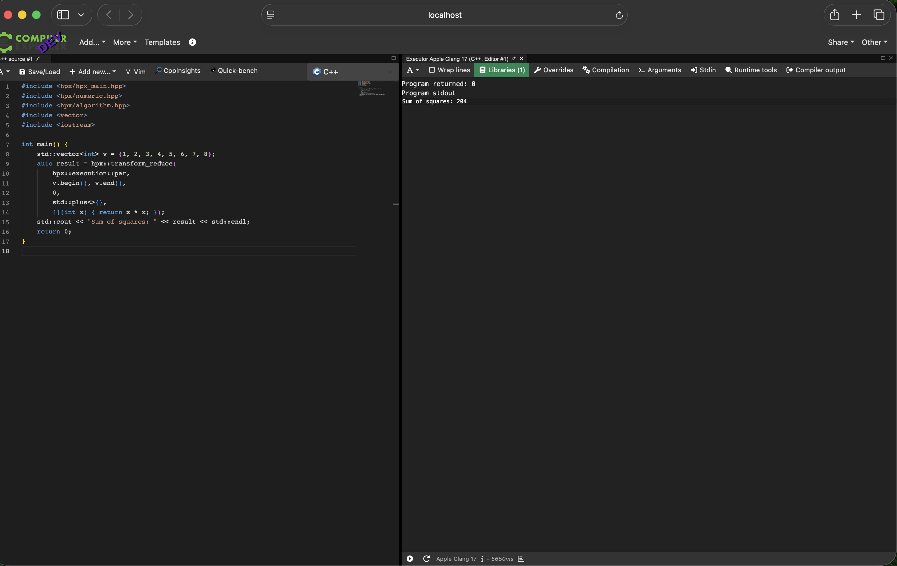
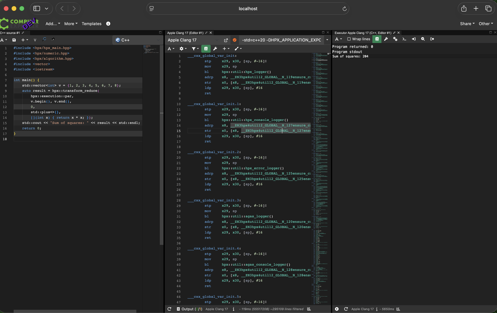

# Integrating HPX with Compiler Explorer

> **GSoC 2026 Proposal & Proof of Concept**
> Jatin Sharma · IIT (BHU) Varanasi · [STEllAR-GROUP/HPX](https://github.com/STEllAR-GROUP/hpx)

## Overview

[Compiler Explorer](https://godbolt.org/) (CE) is a widely popular web-based application which provides easy access to multiple C++ compilers and environments. This project integrates **HPX** — the C++ Standard Library for Parallelism and Concurrency — into Compiler Explorer so that users can write, compile, and execute HPX code directly in the browser.

An HPX entry already exists in CE's production configuration (`c++.amazon.properties`), but it is **completely broken** due to six independent bugs (hardcoded Boost paths, dynamic linking in a static-only sandbox, outdated version, no `skip_compilers`, no default example, undiscoverable `sandbox.hpp`).

This repository contains:
1. **A working Proof of Concept** — HPX 2.0.0 compiling and executing inside a local CE instance
2. **The GSoC 2026 proposal** — full technical analysis with root-cause fixes
3. **Configuration files** — drop-in CE properties and proposed `libraries.yaml`

## Screenshots

### Library Discovery
HPX appears in CE's library search dialog with correct metadata:



### Compilation & Execution
`hpx::transform_reduce` with `hpx::execution::par` compiles and executes successfully:



### Assembly Inspection
Three-pane layout showing source, ARM64 assembly with HPX runtime calls, and execution output:



## Repository Structure

```
├── README.md
├── proposal/
│   ├── proposal_godbolt.tex          # Full LaTeX proposal
│   ├── proposal_godbolt.md           # Markdown version
│   ├── hpx_stellar_logo.png          # HPX/STE||AR logo
│   └── jatin_photo.png               # Author photo
├── poc/
│   ├── c++.local.properties          # CE local config (tested & working)
│   ├── hpx_build.sh                  # HPX build script for PoC
│   └── proposed_libraries.yaml       # Proposed CE infra YAML entry
├── examples/
│   └── transform_reduce.cpp          # Default CE example for HPX
└── screenshots/
    ├── ce_library_search.png
    ├── ce_execution.png
    └── ce_assembly.png
```

## Quick Start (Reproduce the PoC)

### 1. Build HPX for Compiler Explorer

```bash
# Clone HPX
git clone https://github.com/STEllAR-GROUP/hpx.git
cd hpx

# Build with godbolt-minimal flags
cmake -S . -B build/godbolt \
  -G Ninja \
  -DCMAKE_BUILD_TYPE=Release \
  -DHPX_WITH_STATIC_LINKING=OFF \
  -DHPX_WITH_DISTRIBUTED_RUNTIME=OFF \
  -DHPX_WITH_NETWORKING=OFF \
  -DHPX_WITH_TESTS=OFF \
  -DHPX_WITH_EXAMPLES=OFF \
  -DHPX_WITH_FETCH_ASIO=ON \
  -DHPX_WITH_MALLOC=system \
  -DCMAKE_INSTALL_PREFIX=/tmp/hpx-local

cmake --build build/godbolt -j$(nproc)
cmake --install build/godbolt
```

### 2. Set Up Compiler Explorer

```bash
# Clone CE
git clone https://github.com/compiler-explorer/compiler-explorer.git
cd compiler-explorer

# Copy the local properties file
cp /path/to/this/repo/poc/c++.local.properties etc/config/

# Start CE
make dev
```

### 3. Test

Open `http://localhost:10240`, select HPX from the Libraries dropdown, paste the example from `examples/transform_reduce.cpp`, and click Run.

## Root Causes Fixed

| Bug | Problem | Fix |
|-----|---------|-----|
| #1 | Hardcoded Boost 1.84 path | `%DEP0%` interpolation via `libraries.yaml` |
| #2 | Dynamic linking (`.so`) | `lib_type: static` + `staticliblink` |
| #3 | Only v1.11.0 | Target v2.0.0 + v1.11.0 fallback |
| #4 | No `skip_compilers` | Explicit CE compiler IDs for GCC ≤11, Clang ≤14 |
| #5 | No default example | `transform_reduce` with `sandbox.hpp` benchmarking |
| #6 | `sandbox.hpp` undiscoverable | Default example `#include`s it |

## Upstream PRs (Planned)

| PR | Repository | Content |
|----|-----------|---------|
| #1 | `STEllAR-GROUP/hpx` | Refine `godbolt-minimal` preset, improve `sandbox.hpp`, add `CONTRIBUTING_CE.md` |
| #2 | `compiler-explorer/infra` | Fix `libraries.yaml`: static linking, `%DEP0%`, skip_compilers, Ninja |
| #3 | `compiler-explorer/compiler-explorer` | `c++.amazon.properties` entries + default example |

## Mentors

- **Hartmut Kaiser** — HPX Lead, STE||AR Group
- **Giannis Gonidelis** — HPX Core Developer

## Links

- [HPX](https://github.com/STEllAR-GROUP/hpx)
- [Compiler Explorer](https://github.com/compiler-explorer/compiler-explorer)
- [GSoC 2026 Project Page](https://summerofcode.withgoogle.com/)
- [Author's GitHub](https://github.com/GitMasterJatin)